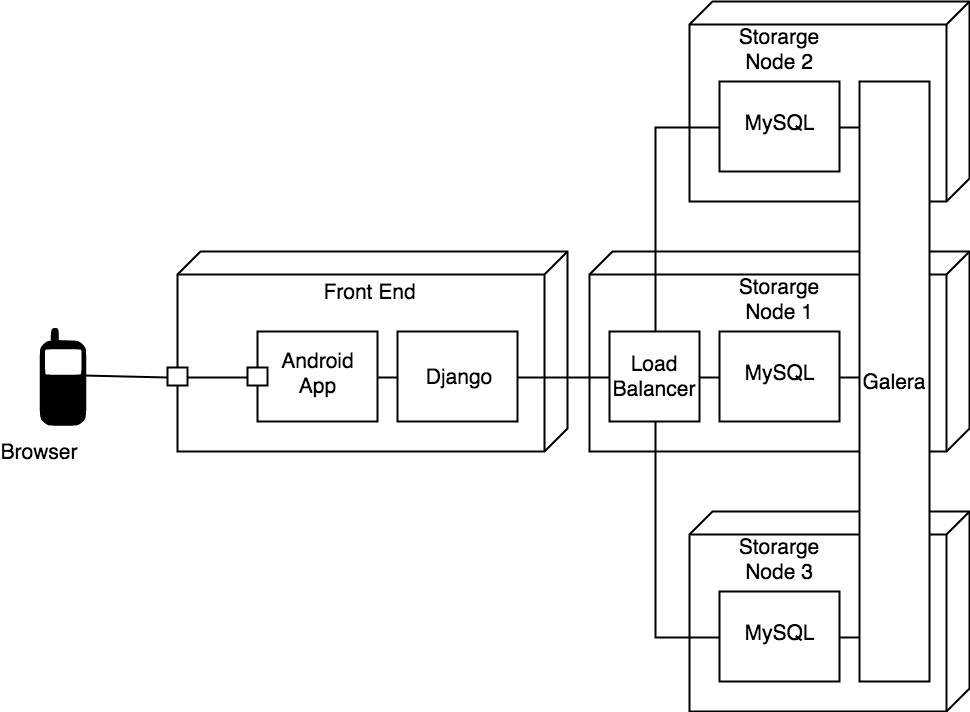

# 概要设计规约

## 原型设计


## 业务架构


## 技术架构


## 部署结构



## 数据建模

### 实体-关系设计


### 数据库设计

**Table:Manager**

|  Column  |   Type   | Description             |
| :------: | :------: | :---------------------- |
|    id    | integer  | key, identifier         |
|   name   | char[64] | name of the manager     |
| password | integer  | password of the manager |

**Table:User**

|   Column   |   Type   | Description            |
| :--------: | :------: | :--------------------- |
|     id     | integer  | key, identifier        |
|    name    | char[64] | name of the user       |
|  password  | integer  | password of the user   |
| cell-phone | integer  | cell-phone of the user |
|  address   | char[64] | address of the user    |
|   E-mail   | char[64] | E-mail of the user     |

**Table:Website**

|   Column    |   Type   | Description         |
| :---------: | :------: | :------------------ |
|     id      | integer  | key, identifier     |
| websiteName | char[64] | name of the website |
| messageName | char[64] | name of the message |
| websiteUrl  | char[64] | url of the website  |

**Table:Message**

|     Column     |   Type   | Description            |
| :------------: | :------: | :--------------------- |
|       id       | integer  | key, identifier        |
| messageContent |   char   | content of the message |
|  messageName   | char[64] | name of the message    |
|   messageUrl   | char[64] | url of the message     |

## 接口规约

---
### *customer/name*   

#### 接口描述

Get the name of a customer.

|                |          |
| -------------- | -------- |
| Request Method | Get      |
| Authorization  | Required |


#### 参数

| Name | Located in | Description | Required | Schema         |
| :--: | :--------: | :---------- | :------: | :------------- |
|  id  |   query    | customer id |   Yes    | number(double) |

#### 返回结果

| Code | Description         | Schema          |
| :--: | :------------------ | :-------------- |
| 200  | Successful response | *name* : string |

#### 示例请求

```
customer/name?userId=214
```

#### 示例结果

```
{

  "name" : "Kanglin Yin"

}

```
---