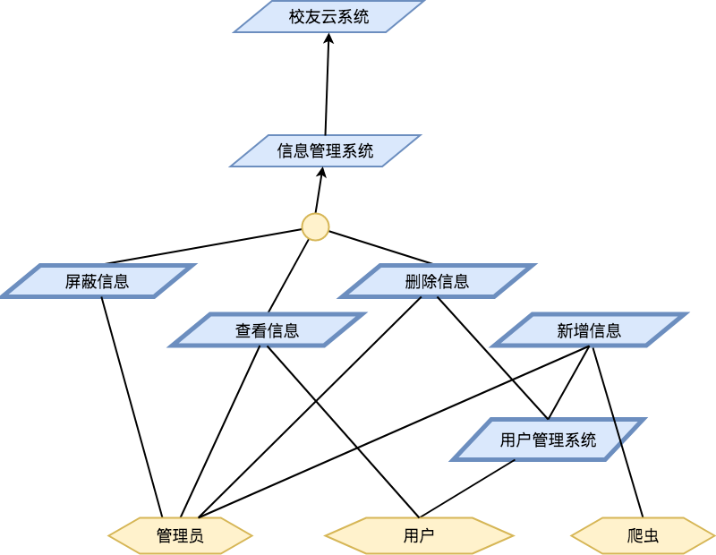
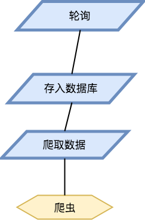
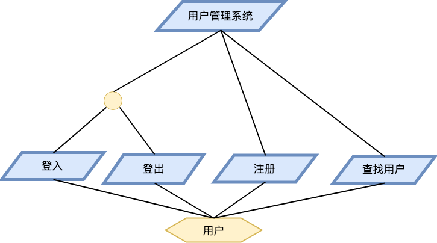

# 需求规约

## 项目介绍

###背景介绍

校友关系是社会关系中较为牢靠的一种关系，而校友资源对于即将离开校园或是已经走上社会的学生来讲也是一笔宝贵的财富。随着互联网的发展，学校对于档案的管理从纸质迈向了网络，不同年级间学生的联系也从单调的学生活动变为了网上交友。可是根据项目组的调查，无论是学校还是学生都没有很好的把握住这种资源。

从学生的角度来看。纵观现今市面上的社交产品，除了已经濒临倒闭的人人网，并没有几样产品是主打校友关系的，可以说到目前为止，校友市场还是一片空白。然而我们现实生活中常常会发生这样一幕，有一位已经毕业的学长学姐会在某个群里面发某知名公司的内推，亦或是你的某个大牛朋友在票圈说自己快要离职了，可以推荐一些同学去世界500强公司等等，那如果你没有加入过这个群或者你不认识这位同学是不是就代表你可能错过了一次非常好的工作机会。我们所缺乏的正是这样一个收集信息并且发散出去的平台。

从学校的角度来讲的话，以同济大学为例，虽然有各种的校友会负责不同地区不同行业的校友，但也只有部分校友有非常详细的记录，而很多的校友在校友会的数据库里都没有详细的记录甚至会有错误的记录，我们所缺乏的也正是这样一种整合校友信息的平台，将被动的信息采集变为主动的信息录入。

### 产品介绍

校友云是一个以为在校师生提供校友信息为主要目的、采集校友信息为次要目的校友应用软件平台。

- 学校认知。校友云可以有效的解决低年级同学甚至是高中生对大学以及专业方向的认知，哪怕在交流前彼此都是陌生人但通过这款软件可以找到同一所学校的学长学姐建立起关系，而不是漫无目的的在网上找可能是某个网络水军的评价。
- 工作需求。校友云可以解决高年级同学对实习以及内推的需求，校友云会有专门的板块放置众多学长学姐的信息供同学去联系。
- 寻友需求。校友云会对学校的学生信息进行录入，哪怕学生没有在校友云进行注册，同学依然可以在校友云中找到学生的信息，当然出于隐私的限制，所能查看到的只有简单的姓名班级，以及代为联系的选项。
- 信息整合。校友云除了对在校师生以及毕业校友提供服务外，还将与学校校友会建立合作，在保证在校友云建立账号的同学信息是真实可靠的情况下，还会帮助校友会对学生的信息进行核实与管理，解决目前校友会校友信息不完善的情况。
- 资讯获取。校友云会为学校的各类官网以及学院官网开设订阅号，在用户关注订阅号后，订阅号会及时将最新消息推送给用户。

## 项目需求分析

## 用例分析

---

### Use Case: _Use Case Name_

#### Description

Describes what the use case do.

#### Participants

Who (Users, systems) will attend the use case.

#### Pre-condition (Optional)

The conditions should be satisfied before the use case starts.

#### Post-condition (Optional)

The conditions will be satisfied after the use case finishes.

#### Process Flow

The process of the test case, either text descriptiopn or flow charts can be used here.

#### Exceptions (Optional)

Exceptions of the use case and how it is resolved.

---